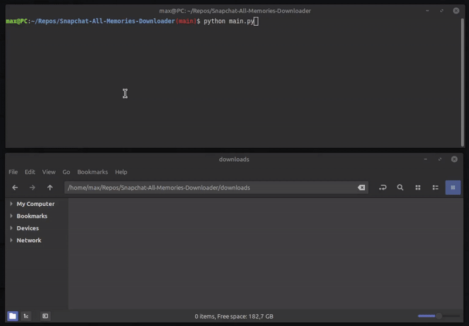

# Snapchat-All-Memories-Downloader
This script will download all your Snapchat memories in bulk, **including the timestamp and geolocation**.




## Getting your Data
- Login to Snapchat: https://accounts.snapchat.com/
- Request your data: https://accounts.snapchat.com/accounts/downloadmydata
- Select the `Export your Memories` and `Export JSON Files` option and continue


## Downloading your Memories
- Clone or [Download](https://github.com/ToTheMax/Snapchat-All-Memories-Downloader/archive/refs/heads/main.zip) this Repository
- Extract the zip-file received from Snapchat in the same folder
- Run the script:
    - Requirements: Python3.10+
    - Install the required packages: 
	```
	pip install -r requirements.txt
	```
    - Run the script: 
    ```
    python main.py
    ```


### Optional Arguments
```
usage: main.py [-h] [-o OUTPUT] [-c CONCURRENT] [--no-exif] [--no-skip-existing] json_file

Download Snapchat memories from data export

positional arguments:
json_file             Path to memories_history.json

options:
-h, --help            show this help message and exit
-o, --output OUTPUT   Output directory
-c, --concurrent CONCURRENT
						Max concurrent downloads
--no-exif             Disable EXIF metadata
--no-skip-existing    Re-download existing files
```

## Trouble Shooting
1. Make sure you get a fresh zip-file before running the script, links will expire over time
2. If you are missing the `memories_history.json` file, make sure you selected the right options in the export configuration
3. Still problems? please make a new [issue](https://github.com/ToTheMax/Snapchat-All-Memories-Downloader/issues) 
